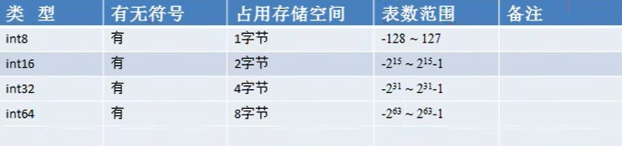
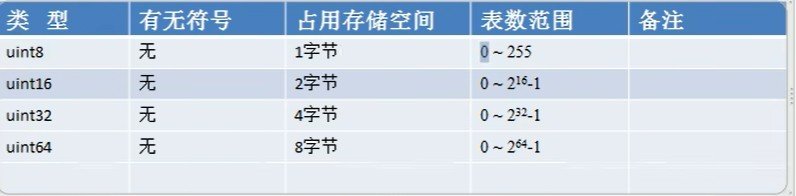
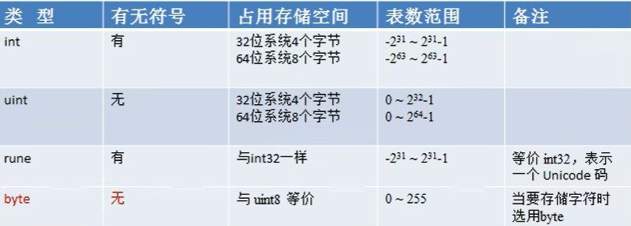

# 一、有符号整数类型





# 二、无符号整数类型




# 三、其他整数类型




# 四、整型使用的注意事项

```markdown
1. Golang中整数类型不显示声明默认为int类型

2. 查看莫格变量的数据类型和字节大小

	var n1 int = 189

	fmt.Printf("n1的类型是%T", n1)

	fmt.Printf("n1的占的大小字节是 %d", unsafe.Sizeof(n1))
```


